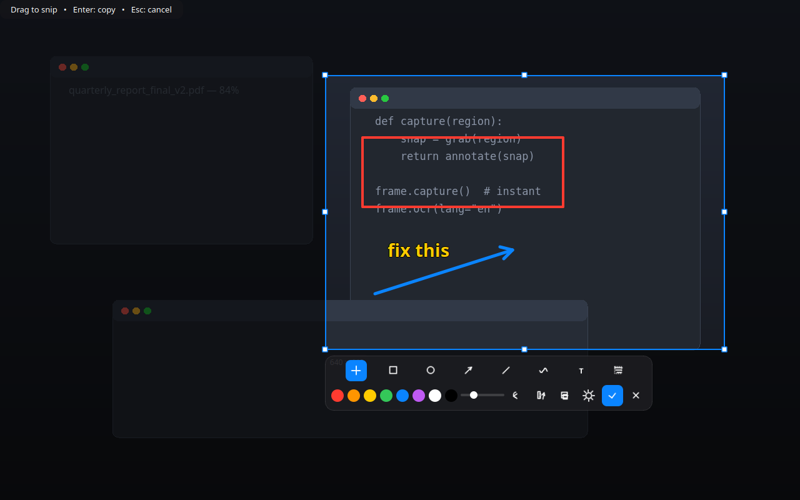

# frameshot

> **Status:** CI green on `main` · latest release: [v0.2.0](https://github.com/rohith-rajeev/frameshot/releases) · repo is currently private, so live badge images are omitted on purpose.

**A modern, Wayland-native screenshot tool: press a hotkey, drag, annotate, done — the image is already in your clipboard.**



frameshot is built for Linux/Wayland from the ground up around one idea: *the best
interface is no interface.* There is no main window, no import dialog, no
save-as dance. You summon it, snip, optionally scribble, and keep working —
the annotated image is on your clipboard before you notice a tool was involved.

- Zero-friction flow: hotkey → crosshair → drag → annotate in place → `Enter`
- Single-stage overlay: selection and annotation happen on the same screen
- Built-in annotation: box, circle, arrow, line, pen, movable text, blur
- Built-in OCR: editable text from any snip, no new windows
- Clipboard-first: disk saving is opt-in, not a roadblock
- Instant: warm background daemon + raw-socket hotkey path (~40ms to summon)
- Multi-monitor: one overlay per output, each showing its own pixels
- No foreign UI, ever: no portal dialogs, no shutter sounds, no popups from
  other tools

## Why frameshot over…

| | frameshot | Flameshot | GNOME Screenshot | grim + slurp |
|---|---|---|---|---|
| Wayland-native (no XWayland) | ✅ | ⚠️ partial / portal quirks | ✅ GNOME only | ✅ wlroots only |
| Annotate without leaving the snip screen | ✅ single stage | ✅ | ❌ | ❌ (needs swappy etc.) |
| Built-in OCR (editable in place) | ✅ Paddle / Tesseract | ❌ | ❌ | ❌ |
| Movable / resizable / rotatable text | ✅ | ❌ | ❌ | — |
| Blur / pixelate regions | ✅ | ✅ | ❌ | ❌ |
| Clipboard-first (no save dialog) | ✅ | ⚠️ configurable | ❌ saves to disk | manual |
| Multi-monitor per-output overlays | ✅ | ⚠️ | ✅ | manual |
| Silent capture (no consent popup, no click) | ✅ via helper extension | ❌ portal dialog | n/a (native UI) | ✅ |
| Hotkey summon in ~40ms | ✅ daemon + socket | slower cold start | n/a | manual binding |

Flameshot is the closest in spirit and a great tool — frameshot exists because on
modern GNOME its portal path pops consent dialogs, its Wayland support lags,
and it has no OCR, no text objects, and no clipboard-first flow. frameshot keeps
the parts of Flameshot you love (drag, annotate, fast) and rebuilds the rest
for Wayland as it actually works today.

macOS users will feel at home too: the flow mirrors CleanShot X / Shottr
(crosshair → toolbar → clipboard), with OCR on top.

## Features

- **Snip**: fullscreen crosshair overlay with magnifier loupe and live `W×H`
  readout; drag to select, drag inside to move, 8 handles to resize,
  click outside to re-snip, double-click/`Enter`/`Ctrl+C` to accept.
- **Annotate**: rectangle, ellipse, arrow, line, free pen, blur/pixelate,
  8-color palette, 5 stroke widths, undo, one-click clear via re-snip.
- **Text objects**: click to place (multiline — `Shift+Enter` breaks lines,
  click-away places without closing), click again to edit, drag body to move,
  corners to resize, top handle to rotate, `Del` to remove, swatches recolor
  the selected text live.
- **OCR**: toolbar button opens a popup right above the snip; recognition
  starts by itself, result is editable with one-click copy to clipboard.
  Canvas freezes while the popup is open so nothing shifts underneath.
- **Clipboard-first**: `Enter`/`Ctrl+C` copies and closes. Disk saving only
  when you ask (`Ctrl+S`, toolbar, or always-on in Settings).
- **Background service**: systemd user unit, starts at login, restarts on
  failure, stoppable with `frameshot --stop`. Captures run in its stable,
  pre-authorized context, so hotkey launches never hit portal consent dialogs.
- **Hotkey management**: Settings page reads/writes the GNOME keybinding,
  refuses combos already taken (and names the offender), suggests free ones.
- **Diagnostics**: `frameshot doctor` reports extension state, portal bus,
  permissions, backends, and every custom hotkey on one screen.
- **Settings GUI**: background service, hotkey, save location/format, OCR
  engine — no config files to hand-edit (`frameshot settings` opens it anywhere).

## Native Wayland support

Wayland compositors own every pixel — no userspace app may read them except
through a consent path. frameshot handles each compositor the right way:

- **GNOME**: our tiny, UI-less Shell extension (`frameshot-capture@frameshot.local`)
  runs *inside* the compositor and captures exactly like GNOME's own
  screenshot facility — no portal, no consent dialog, no shutter sound. It
  exposes one bus method (`org.frameshot.Capture.Screenshot`) that hands frameshot
  a PNG path. Installed + enabled by `install.sh` (one logout/login to load).
- **wlroots (Sway, Hyprland, …)**: `grim` — fastest path, no dialog.
- **KDE**: `spectacle` backend.
- **Fallback**: XDG Screenshot portal (silent, retried once), then legacy
  GNOME calls. The portal's *interactive* mode (which pops GNOME's
  screenshot UI) exists only as an opt-in fallback, default **off** — a stock
  frameshot install never opens another tool's window.
- **Multi-monitor**: one overlay per output, each showing that screen's own
  pixels (a single Wayland window cannot span outputs). Snip on any screen;
  starting a snip on another moves the session there.

Global hotkeys can't be registered from inside a Wayland app, so the
compositor calls `frameshot`: `scripts/setup-hotkey.sh` wires GNOME, and the
Settings page manages it from the GUI (Sway/Hyprland/KDE one-liners included).

## Requirements

- Linux with Wayland (GNOME 50 supported; wlroots and KDE via backends)
- Python 3.10+, PyQt6, Pillow, PyGObject (`python3-gi` — distro package)
- `wl-clipboard` for persistent clipboard, `tesseract-ocr` for offline OCR

```bash
sudo apt install python3-gi wl-clipboard tesseract-ocr   # Debian/Ubuntu
# + grim on wlroots compositors: sudo apt install grim
# Optional, heavy OCR: pip install "frameshot[ocr-paddle]"
```

## Install

```bash
git clone https://github.com/rohith-rajeev/frameshot && cd frameshot
bash scripts/install.sh
```

This creates an isolated venv (`--system-site-packages`, so the distro's
`python3-gi` is visible), installs frameshot editable with the Tesseract extra,
links `~/.local/bin/frameshot`, registers the app + minimal icon, installs and
enables the GNOME Shell extension, configures the `Ctrl+Shift+F` hotkey
(skipped if taken), and enables + starts the background service.

Log out and back in once so GNOME Shell loads the capture extension.

Manual install:

```bash
/usr/bin/python3 -m venv --system-site-packages .venv
.venv/bin/pip install -e ".[ocr-tesseract]"
```

## Use

| Action | How |
|---|---|
| Snip + annotate | Hotkey (or `frameshot`) → crosshair → drag → toolbar appears → draw right there. `Enter`/`Ctrl+C`/double-click copies, `Esc`/right-click cancels |
| Tools | `V` move/resize, `R` box, `C` circle, `A` arrow, `L` line, `P` pen, `T` text, `B` blur, `Ctrl+Z` undo, `Del` deletes selected text |
| Text | Click to place (`Shift+Enter` new line, `Enter` places + copies); click away places without closing; `V` drags / resizes / rotates; swatches recolor live |
| OCR | Toolbar scan icon → popup above the snip, recognition starts itself → edit → Copy text. `Esc` closes popup, second `Esc` cancels |
| Save | `Ctrl+S`, toolbar button, or always-on in Settings |
| Background | Automatic via systemd (`frameshot-daemon.service`); `frameshot --stop` opts out |
| Hotkey | Settings page shows/sets it (GNOME); `scripts/setup-hotkey.sh` for the rest |
| Settings | Gear button (bottom-right pre-snip, toolbar post-snip) or `frameshot settings` |
| Updates | Settings shows the version and offers **Check for updates**: compares against the latest GitHub release, and on approval downloads the bundle, reinstalls, and restarts on the new version. Releases are cut automatically from `main` (bump `__version__` to ship); only the latest 10 are kept |

CLI reference:

```bash
frameshot                 # capture (instant via daemon if warm)
frameshot capture         # same, explicit
frameshot settings        # open the GUI settings page
frameshot doctor          # diagnose capture pipeline, permissions, hotkeys
frameshot config --show   # show config path + values
frameshot --daemon        # run the warm background service
frameshot --stop          # stop service + login autostart
frameshot --no-daemon ... # (flag) skip daemon fast-path for capture
```

Settings live in `~/.config/frameshot/settings.ini` but you should never need to
open it — everything is in the GUI.

## Troubleshooting

- **`portal Screenshot failed (response=2)`** — GNOME denied a silent
  capture. With the Shell extension loaded this path is never used; without
  it, run `frameshot doctor`, allow screenshots in Settings → Apps, or capture
  once from a terminal and accept the consent dialog.
- **Hotkey does nothing** — check `frameshot doctor` for conflicts (it lists every
  custom binding and flags yours). Re-apply from Settings, which refuses
  taken combos.
- **Overlay shows one squeezed screen** — update: frameshot opens one overlay per
  output. If you see the old behavior, pull latest.
- **Daemon not instant** — `systemctl --user status frameshot-daemon`; restart
  with `frameshot --daemon &` or re-run `install.sh`.

## Uninstall

```bash
bash scripts/uninstall.sh                        # app, venv, hotkey, extension, config
bash scripts/uninstall.sh --dry-run              # preview first
bash scripts/uninstall.sh --keep-config          # keep ~/.config/frameshot/settings.ini
bash scripts/uninstall.sh --remove-screenshots   # also delete ~/Pictures/frameshot
```

Screenshots are kept by default; system packages are never removed.
Hand-added Sway/Hyprland/KDE keybinding lines must be deleted manually —
the script prints reminders.

## Project layout

```
src/frameshot/
  cli.py        argparse + raw-socket daemon fast-path (~40ms summon)
  app.py        orchestration + QLocalServer warm daemon (survives its windows)
  capture.py    extension/grim/portal(+retry)/spectacle/GNOME chain
  doctor.py     diagnostics: extension, portal, permission store, hotkeys, OCR deps
  overlay.py    single-stage overlay: snip + annotate + OCR popup + glass toolbar
  icons.py      runtime-drawn vector toolbar icons (no asset files)
  ocr.py        lazy PaddleOCR / tesseract worker (nothing imported at startup)
  clipboard.py  Qt clipboard + wl-copy persistence
  config.py     clipboard-first settings model
  background.py daemon/autostart control + GNOME hotkey read/write + conflict check
shell-extension/frameshot-capture@frameshot.local/
  extension.js  in-compositor capturer (org.frameshot.Capture on session bus)
  metadata.json GNOME 50
assets/         desktop entries, minimal icon (SVG + PNG), demo screenshot
scripts/        install / uninstall / hotkey setup
```

## OCR engine choice

`ocr_engine=auto` → PaddleOCR if installed, else `tesseract`. PaddleOCR is
~500MB+ and downloads models on first use, so it stays an optional,
lazily-loaded extra — the base install is light. Tesseract
(`sudo apt install tesseract-ocr`) covers most Latin screenshots instantly.
Paddle needs **both** `paddleocr` and `cv2`: `pip install 'frameshot[ocr-paddle]'`
pulls everything (paddlepaddle, paddleocr, numpy, opencv); a missing piece
reports that exact command instead of `No module named 'cv2'`.

## License

MIT — see [LICENSE](LICENSE).
